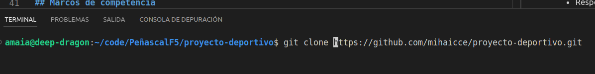

## Tabla de contenido
1. [Información general](#informacion-general)
2. [Estado actual](#estado-actual)
3. [Tecnologías utilizadas](#tecnologias-usadas)
4. [Instalación y prueba](#instalacion-y-prueba)
5. [Marcos de competencia](#marcos-de-competencia)
6. [Equipo](#equipo)
7. [Agradecimientos](#agradecimientos)
***

## Información general
Web estática para equipo local de Quadball, con sede en Portugalete, los Boggarts Bizkaia.
Consta de:
* Home: Información general.
* Sobre Nosotros: Con información sobre el equipo y sobre el juego en sí.
* Galería: Con fotos del equipo.
* Noticias: Noticias sobre el quadball a nivel mundial y calendario de eventos del propio equipo.
* Contacto: En el que aparecen un formulario de contacto, su ubicación y redes sociales.

## Estado actual
Actualmente casi listo para el primer sprint review, a falta de revisar el cumplimiento de todos los requisitos establecidos por el cliente.
Revisar especialmente el SEO, las propiedades transform y transition y autoría de las fotos.

## Tecnologías utilizadas
* HTML5
* CSS3
* Git
* Linux
* Visual Studio Code
* GitHub

## Instalación y prueba
1. Copie la URL del proyecto:
```
https://github.com/mihaicce/proyecto-deportivo.git
```
2. Abra un terminal en su Visual Studio Code, seleccione la carpeta en la que quiere poner el proyecto y clónelo (para ésto deberá tener instalado en su terminal git):


```
$ git clone https://github.com/mihaicce/proyecto-deportivo.git
```

3. Sitúese en la página principal, denominada index.html y ábrala. Presione el botón derecho del ratón y escoja la opción "Open in default browser" o presione Ctrl+B. Se abrirá el navegador con la página principal de nuestra web y ya podrá navegar para probarla.

## Marcos de competencia
* HTML5
* Responsive desing
* Flex/Grid
* Git
* SCRUM
* Linux
* SEO
* CSS3
* Visual Studio Code

## Equipo
* Mihai Cocea (SCRUM Master)
* May Torres
* Jone Guerrero
* Amaia Berrocal
* Jonathan Echevarria 
* Andrés Ocina (Product owner)

## Agradecimientos
Gracias a todas las compañeras y compañeros de la clase del bootcamp F5 por ayudarnos a resolver dudas y a superar pequeños baches que han surgido en el desarrollo de esta web. 
En especial a Anyell y a Jessica, que nos ayudó mucho con el css de los iconos de rrss.

